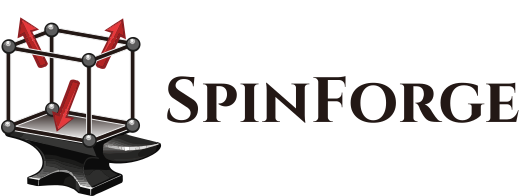

<div align="center">

# 

</div>

SpinForge is a group-theoretic generator for spin-symmetry-adapted (SSA) and
oriented magnetic crystal structures based on spin space groups.

## Installation

SpinForge supports Python 3.11 and later.

```shell
python -m pip install spinforge
```

For a source checkout and contributor setup, see
[CONTRIBUTING.md](./CONTRIBUTING.md).

## Quickstart: oriented magnetic structures

Given a primitive crystal structure in `MnTe.cif`, this example enumerates
collinear SSA candidates with propagation-vector index one and generates every
maximal oriented descendant:

```python
from moyopy import Cell
from pymatgen.core import Structure
from spinspg.spin import SpinOnlyGroupType

from spinforge.configuration import SSAGenerator

structure = Structure.from_file("MnTe.cif")
prim_cell = Cell(
    basis=structure.lattice.matrix.tolist(),
    positions=structure.frac_coords.tolist(),
    numbers=list(structure.atomic_numbers),
)
magnetic_site_indices = [
    index for index, atomic_number in enumerate(prim_cell.numbers) if atomic_number == 25
]

generator = SSAGenerator(
    prim_cell=prim_cell,
    magnetic_site_indices=magnetic_site_indices,
)

for spin_only_group, spin_space_group, adapted_structure in generator.enumerate(
    spin_only_group_type=SpinOnlyGroupType.COLLINEAR,
    k_index=1,
    max_depth=0,
):
    oriented_structures = generator.generate_oriented(
        adapted_structure,
        spin_only_group=spin_only_group,
        nontrivial_spin_space_group=spin_space_group,
    )
    for magnetic_structure, magnetic_space_subgroup in oriented_structures:
        print(magnetic_structure.formula, magnetic_space_subgroup.msg_type)
```

`SSAGenerator` requires a primitive input cell. The family-subgroup,
spin-space-group, and oriented spin-frame equivalence controls are separate.
See the [enumeration and equivalence guide](./docs/equivalence.md) for the
precise criteria and the options for larger searches.

## Examples

The paper examples are provided as notebooks in [`examples/paper`](./examples/paper):

- [collinear MnTe](./examples/paper/collinear_MnTe)
- [coplanar Mn3Sn](./examples/paper/coplanar_Mn3Sn)
- [noncoplanar CoTa3S6](./examples/paper/noncoplanar_CoTa3S6)

These examples are published as-is. The paper figures, MAGNDATA-derived
datasets, and the raw 283-material SDFT workflow are not part of this
repository.

## Project scope, compatibility, and support

SpinForge provides symmetry enumeration, SSA and oriented-SSA structure
generation, and spinCIF/MCIF-related utilities. It does not determine or refine
magnetic structures from experimental or first-principles data, and it does
not include scattering, electronic-structure, or high-throughput DFT
workflows.

### Compatibility

SpinForge supports Python 3.11 through 3.14. Beginning with version 1.0,
documented interfaces re-exported by public SpinForge modules are kept
compatible within the 1.x series. Names or modules with a leading underscore
are private and may change without deprecation. Mathematical-validity,
data-integrity, or security corrections are documented in the changelog when
they require an exceptional incompatible change.

The spinCIF dictionary is preliminary upstream. SpinForge records the supported
revision in `spinforge.scif.SPINCIF_REVISION`, and spinCIF syntax may evolve
independently of the Python API policy.

### Support

Please use
[GitHub Issues](https://github.com/spglib/spinforge/issues) for reproducible
bugs and in-scope feature requests. Security reports follow
[SECURITY.md](./SECURITY.md).

## Citation

If SpinForge contributes to published work, cite the software metadata in
[`CITATION.cff`](./CITATION.cff) and the associated oriented-spin-space-group
paper:

> T. Nomoto, K. Shinohara, H. Watanabe, and R. Arita,
> “Systematic magnetic structure generation based on oriented spin space
> groups: Formulation, applications, and high-throughput first-principles
> calculations,” *Physical Review X* (accepted 2026).
> [doi:10.1103/8n3w-h2t1](https://doi.org/10.1103/8n3w-h2t1)

## Data attribution and license

Third-party and literature-derived fixture notices are collected in
[`THIRD_PARTY_DATA.md`](./THIRD_PARTY_DATA.md), including all Materials Project
fixtures and the MnTe and Mn3Sn source notices.

SpinForge source code is distributed under the
[BSD 3-Clause License](./LICENSE). Third-party data retain the terms identified
in their notices.
