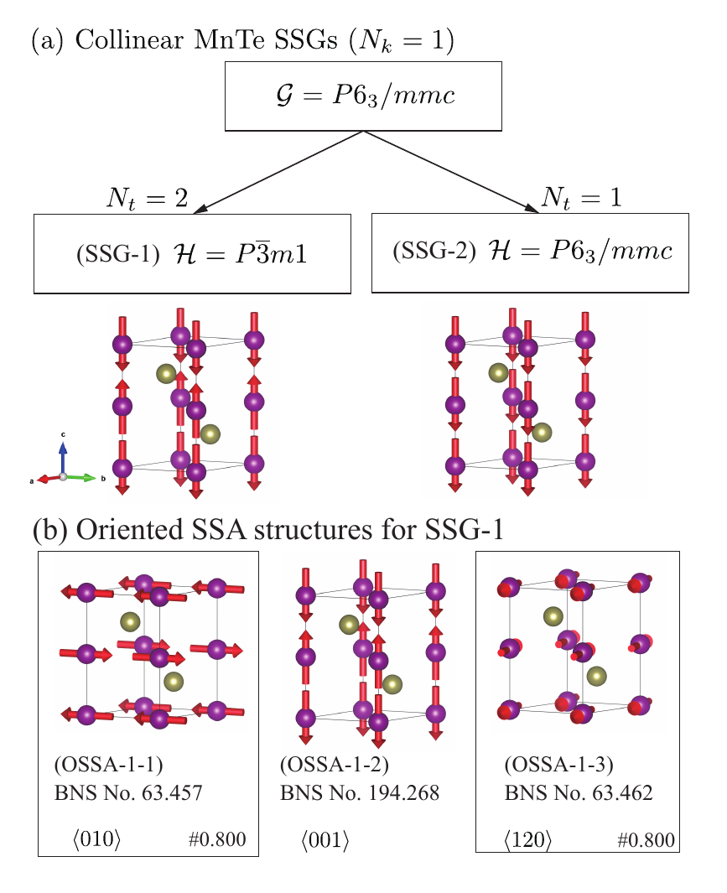
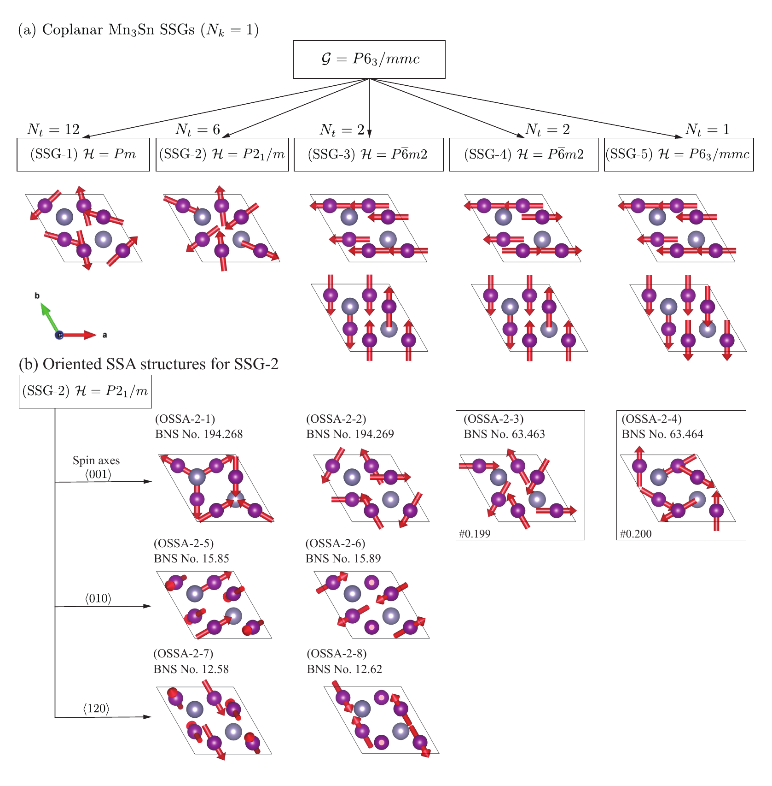
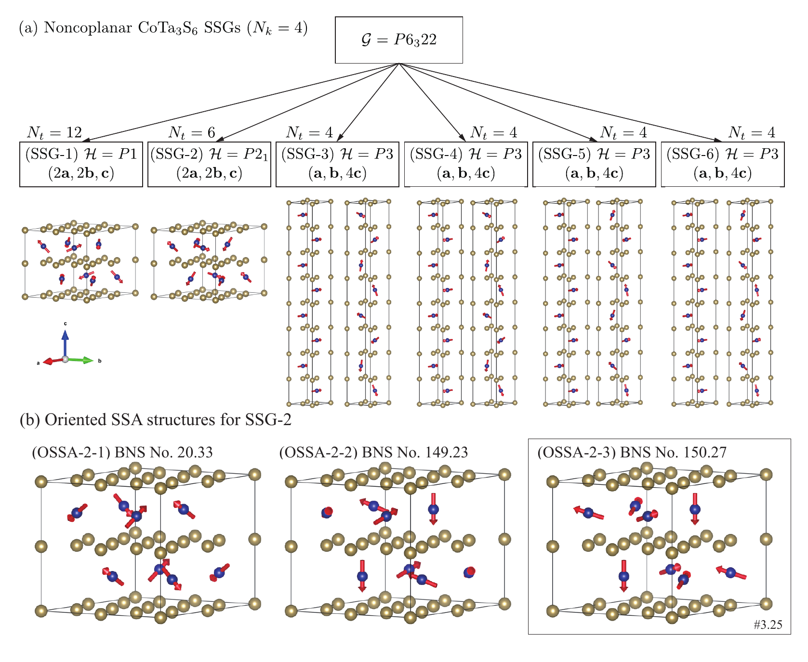

# Examples

!!! abstract "Page contract"

    - **Starting point:** You have completed
      [Your first structure](quickstart.md) and want to map that workflow to a
      physical example.
    - **Destination:** You can choose the notebook whose spin-only-group class
      and translation bound match your task.
    - **Next:** Open that notebook and use the article for its scientific
      interpretation.
    - **Skip:** This page if you only need an exact API signature.

The repository contains the notebooks used for three representative examples
in the [SpinForge article](https://doi.org/10.1103/8n3w-h2t1). Each follows the
same software workflow: choose the magnetic sites, select a spin-only-group
class and `k_index`, enumerate SSA structures, generate oriented descendants,
and write spinCIF output. The article is the source for the formalism,
derivations, and physical interpretation.

## Schematic overview

The figures summarize the enumerated spin space groups and representative
oriented structures. Follow each figure to its corresponding notebook for the
software workflow, and use the article for interpretation.

=== "Collinear MnTe"

    { .paper-figure }

    Continue with the [collinear MnTe notebook](https://github.com/spglib/spinforge/blob/main/docs/paper/collinear_MnTe.ipynb).

=== "Coplanar Mn₃Sn"

    { .paper-figure }

    Continue with the [coplanar Mn₃Sn notebook](https://github.com/spglib/spinforge/blob/main/docs/paper/coplanar_Mn3Sn.ipynb).

=== "Noncoplanar CoTa₃S₆"

    { .paper-figure }

    Continue with the [noncoplanar CoTa₃S₆ notebook](https://github.com/spglib/spinforge/blob/main/docs/paper/noncoplanar_CoTa3S6.ipynb).
